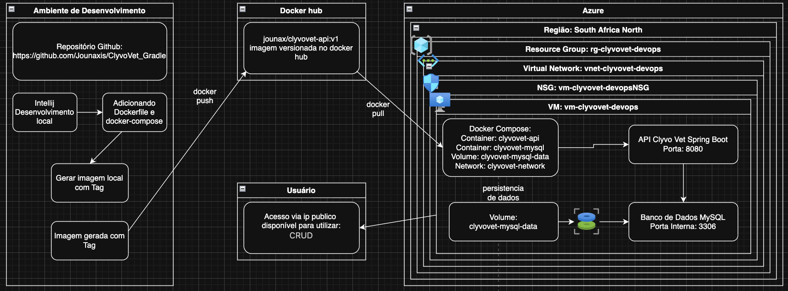

# ClyvoVet API - DevOps com Docker e Azure

Projeto Java desenvolvido com Spring Boot, Gradle, Docker, Docker Compose, MySQL e Azure.

O objetivo deste projeto é realizar o provisionamento de uma infraestrutura em nuvem utilizando Azure CLI, executar uma aplicação Java em uma Máquina Virtual Linux na Azure e utilizar Docker para orquestrar a API e o banco de dados MySQL.

---

## Tecnologias utilizadas

- Java 21
- Spring Boot
- Gradle
- MySQL 8.0
- Docker
- Docker Compose
- Docker Hub
- Azure CLI
- Máquina Virtual Linux Ubuntu 22.04

---

## Arquitetura da solução

A arquitetura do projeto foi organizada em três partes principais:

1. Ambiente de desenvolvimento local
2. Docker Hub
3. Ambiente em nuvem na Azure



---

## Descrição da arquitetura

No ambiente local, o projeto foi desenvolvido utilizando IntelliJ IDEA.  
Após a implementação da aplicação Java, foram adicionados os arquivos `Dockerfile` e `docker-compose.yml`.

A imagem da aplicação foi gerada localmente com tag de versão e enviada para o Docker Hub.

Imagem publicada:

```bash
jounax/clyvovet-api:v1
````

Na Azure, foi provisionada uma Máquina Virtual Linux utilizando um script criado com Azure CLI.

Dentro da VM, a aplicação é executada com Docker Compose, utilizando dois containers principais:

* `clyvovet-api`: container da API Java Spring Boot
* `clyvovet-mysql`: container do banco de dados MySQL

A aplicação se comunica com o banco pela rede interna do Docker Compose.

---

## Recursos provisionados na Azure

A infraestrutura foi provisionada na região:

```text
South Africa North
```

Recursos utilizados:

```text
Resource Group: rg-clyvovet-devops
Virtual Machine: vm-clyvovet-devops
Virtual Network: vnet-clyvovet-devops
Network Security Group: vm-clyvovet-devopsNSG
```

Portas liberadas na VM:

```text
22    SSH
80    HTTP
443   HTTPS
8080  API Java Spring Boot
```

A porta `3306` do MySQL é utilizada internamente entre os containers e não precisa ser exposta publicamente na Azure.

---

## Docker Hub

A imagem da aplicação foi versionada e enviada para o Docker Hub:

```bash
jounax/clyvovet-api:v1
```

Comandos utilizados localmente:

```bash
docker login
docker compose build
docker push jounax/clyvovet-api:v1
```

---

## Docker Compose

O projeto utiliza Docker Compose para executar a aplicação e o banco de dados em conjunto.

Serviços definidos:

```text
clyvovet-api
clyvovet-mysql
```

Rede Docker:

```text
clyvovet-network
```

Volume nomeado para persistência dos dados do banco:

```text
clyvovet-mysql-data
```

Esse volume garante que os dados do MySQL sejam mantidos mesmo que o container seja removido.

---

## Execução em background

A aplicação é executada em background utilizando:

```bash
docker compose up -d
```

O parâmetro `-d` executa os containers em modo detached, ou seja, em segundo plano.

---

## Usuário sem privilégios administrativos

A aplicação Java é executada no container com um usuário sem privilégios administrativos.

No `Dockerfile`, foi definido:

```dockerfile
RUN useradd -m appuser
USER appuser
```

Dessa forma, o container da aplicação não executa o processo Java como usuário root.

---

## Provisionamento da VM com Azure CLI

A criação da infraestrutura é realizada por meio de um script Bash com comandos Azure CLI.

O script realiza as seguintes tarefas:

1. Cria o Resource Group
2. Cria uma Máquina Virtual Linux Ubuntu
3. Abre as portas necessárias no NSG
4. Instala Docker
5. Instala Docker Compose
6. Instala ferramentas auxiliares como Git, nano, curl e unzip

Após a criação da VM, o script exibe o IP público para acesso SSH e para teste da API.

---

## Execução na VM Azure

Após criar a VM, acesse via SSH:

```bash
ssh rm560907@IP_PUBLICO_DA_VM
```

Clone o repositório:

```bash
git clone https://github.com/Jounaxis/ClyvoVet_Gradle
```

Entre na pasta do projeto:

```bash
cd ClyvoVet_Gradle
```

Faça login no Docker Hub:

```bash
docker login
```

Baixe as imagens definidas no Docker Compose:

```bash
docker compose pull
```

Execute a aplicação e o banco em background:

```bash
docker compose up -d
```

Verifique se os containers estão em execução:

```bash
docker ps
```

---

## Teste externo da aplicação

Com a aplicação em execução, acesse pelo navegador:

```text
http://IP_PUBLICO_DA_VM:8080
```

Swagger:

```text
http://IP_PUBLICO_DA_VM:8080/swagger-ui.html
```

ou:

```text
http://IP_PUBLICO_DA_VM:8080/swagger-ui/index.html
```

---

## Comandos úteis

Ver containers em execução:

```bash
docker ps
```

Ver logs da API:

```bash
docker logs clyvovet-api
```

Ver logs do MySQL:

```bash
docker logs clyvovet-mysql
```

Ver volumes criados:

```bash
docker volume ls
```

Parar os containers:

```bash
docker compose down
```

Parar os containers e remover volumes:

```bash
docker compose down -v
```

---

## Requisitos atendidos

### 01 - Script Azure CLI

O projeto possui um script completo em Bash utilizando Azure CLI para:

* Provisionar uma Máquina Virtual Linux na Azure
* Abrir as portas necessárias ao projeto
* Instalar Docker na VM criada
* Instalar ferramentas necessárias, como Git, nano, curl e unzip

### 02 - Execução da aplicação com Docker na VM

A aplicação Java e o banco MySQL são executados na VM utilizando Docker Compose.

Requisitos atendidos:

* Projeto executando em background com `docker compose up -d`
* Aplicação rodando com usuário sem privilégios administrativos
* Banco MySQL utilizando volume nomeado para persistência dos dados

Volume utilizado:

```text
clyvovet-mysql-data
```

Imagem versionada:

```text
jounax/clyvovet-api:v1
```